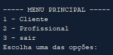
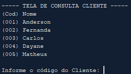
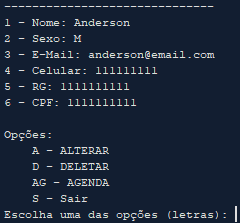

<h1>Agenda Terminal</h1>

  Este foi um projeto que eu pensei em criar para praticar a maior quantidade de conhecimento relativo ao POO que eu adquiri com a apostila da caelum FJ-11 e com o curso de Java POO da plataforma Curso em Vídeo

<h2>:dart: Objetivo</h2>

Um sistema de agendamento que permite agendar clientes com profissionais no terminal

Funcionalidades:

<ul>
  <li>Cadastra, consulta, altera e remove clientes</li>
  <li>Cadastra, consulta, altera e remove profissionais</li>
  <li>Cliente pode agendar, consultar agenda e cancelar agendamento</li>
  <li>Profissional pode consultar agendamento</li>
</ul>

Principais telas:

<h2>:mortar_board: Habilidades usadas</h2>
<ul>
  <li>Java</li>
  <li>  POO (programação orientada a objetos)</li>
  <li>Lógica de Programação</li>
  <li>NetBeans</li>
</ul>

<h2>:package: Requisitos</h2>

Apenas do JAVA versão 8 ou superior instalando no seu computador, você pode baixar <a href="https://www.java.com/pt-BR/">clicando aqui</a>

<h2>:checkered_flag: Para abrir o programa</h2>

Se for pelo Window, abra o DOS(Prompt de Comandos) e execute os seguintes passos:

<ol>
  <li>Vá até a pasta do projeto através do comando CD "ENDEREÇO", por exemplo se tiver na Área de Trabalho: cd "C:\Users\ander\OneDrive\Área de Trabalho\Agenda-Terminal"</li>
  <li>Entre na pasta dist do projeto com o seguinte comando: cd dist</li>
  <li>faça o seguinte comando: java -jar 02_-_Agenda_1.0.jar</li>
</ol>

Se for Linux, abra o terminal e execute os seguintes passos:

<ol>
  <li>Vá até a pasta do projeto através do comando CD "ENDEREÇO", por exemplo se tiver na Área de Trabalho: cd "C:/Users/ander/OneDrive/Área de Trabalho/Agenda-Terminal"</li>
  <li>Entre na pasta dist do projeto com o seguinte comando: cd dist</li>
  <li>faça o seguinte comando: java -jar 02_-_Agenda_1.0.jar</li>
</ol>

<h2>:pray: Ajuda</h2>

  

  Se você gostou do projeto, por favor não esqueça de:
  

  
  <ol>
  <li>Dar sua recomendação, das habilidade utilizadas nesse projeto, no meu Linkedin</li>
    <ul>
      <li>  JAVA</li>
      <li>  POO (programação orientada a objetos)</li>
      <li>  Lógica de programação</li>
      <li>  NetBeans</li>
    </ul>
  <li>Caso você tenha algum comentário, feedback ou sugestão me mande uma mensagem também no <a href="linkedin.com/in/anderson-correia">meu LinkedIn</a></li>
  </ol>
  
  

  Muito obrigado pela sua colaboração !!!
  

